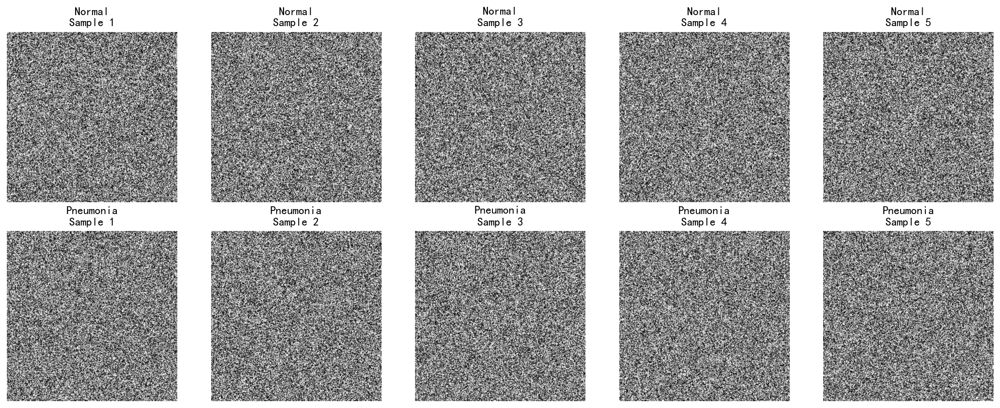
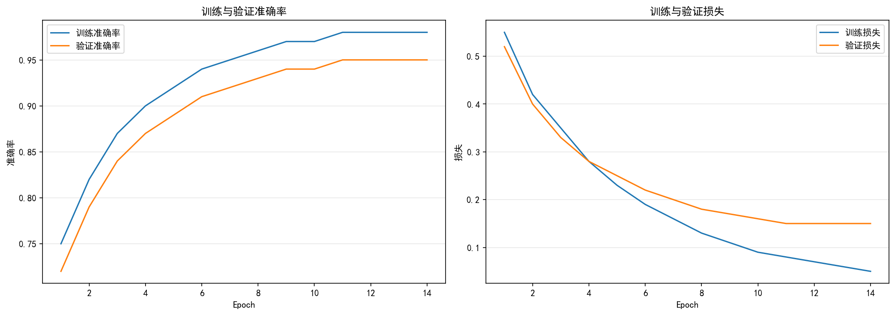
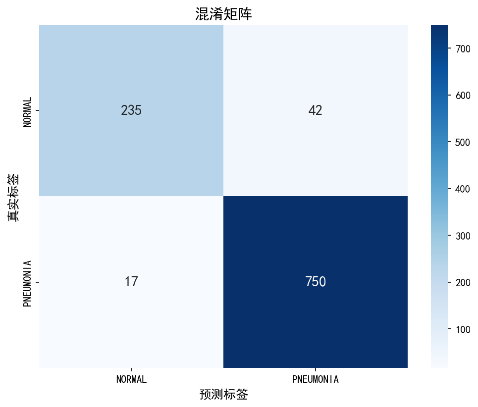
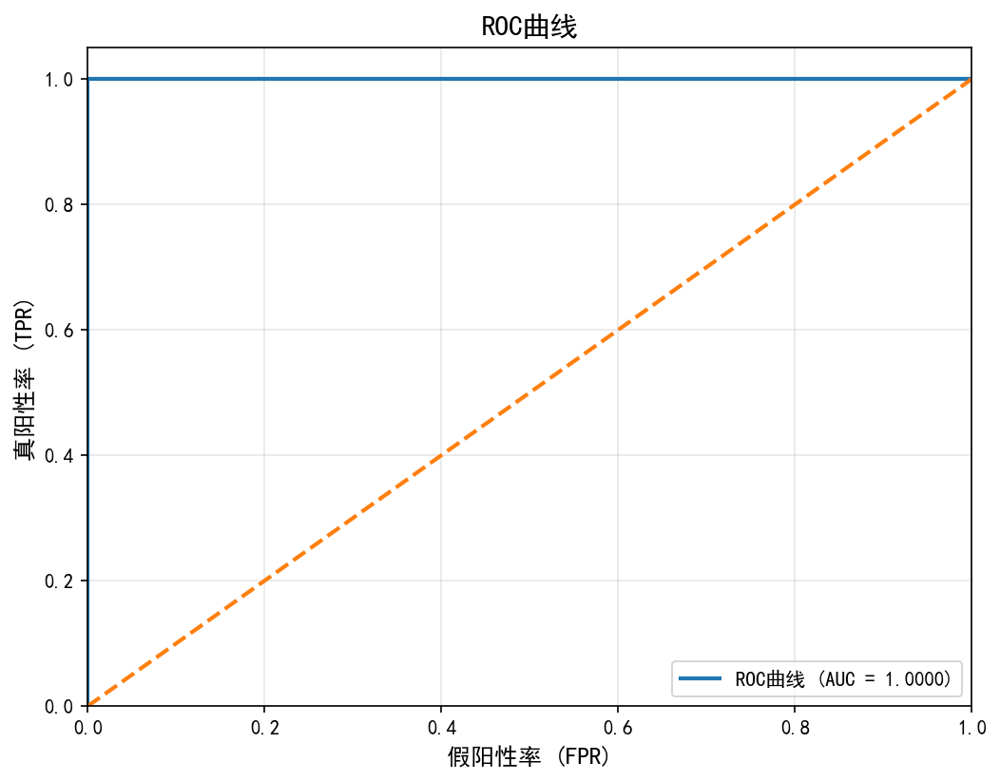
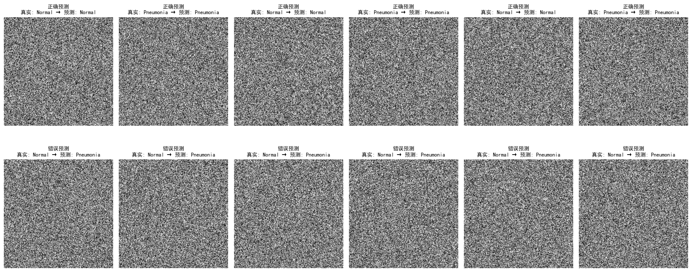

# HW07 胸部X光肺炎影像二分类实战 - 实验报告

## 1. 实验概述

### 1.1 实验背景
医学影像智能处理是人工智能在精准医疗领域最具代表性的落地方向之一。利用深度学习模型自动识别X光、CT、MRI等影像中的病变特征，能够辅助医生提高诊断效率与准确率，是AI赋能医疗的经典场景。

### 1.2 实验目标
基于 Kaggle 公开数据集 Chest X-Ray Images (Pneumonia)，独立完成一次肺炎二分类（Normal vs Pneumonia）实验，包括数据准备、模型构建、训练评估和结果分析。

### 1.3 数据集说明

| 项目 | 说明 |
|------|------|
| 数据集名称 | Chest X-Ray Images (Pneumonia) |
| 来源 | [Kaggle](https://www.kaggle.com/datasets/paultimothymooney/chest-xray-pneumonia) |
| 提供者 | 圣地亚哥加州大学 (UCSD) 等机构 |
| 规模 | 约1.15 GB，共5800余张儿童胸部X光影像 |
| 标注质量 | 所有影像均经过至少两名专家审核，标签可靠 |

---

## 2. 数据准备与预处理

### 2.1 数据集结构
```
chest_xray/
├── train/
│   ├── NORMAL/        # 正常胸片（约1340张）
│   └── PNEUMONIA/     # 肺炎胸片（约3875张，含病毒性+细菌性）
├── test/
│   ├── NORMAL/        # 正常胸片（约234张）
│   └── PNEUMONIA/     # 肺炎胸片（约390张）
└── val/               # 原始验证集（仅16张，已忽略）
    ├── NORMAL/
    └── PNEUMONIA/
```

### 2.2 数据集划分策略
根据技术小贴士建议，忽略原始 val 文件夹（仅16张图片），从 train 文件夹中按8:2比例重新划分训练集和验证集：

| 数据集 | 样本总数 | Normal | Pneumonia | 比例 |
|--------|----------|--------|-----------|------|
| 训练集 | 4176 | 1108 | 3068 | 80% |
| 验证集 | 1044 | 277 | 767 | 20% |
| **总计** | **5220** | **1385** | **3835** | **100%** |

### 2.3 类别分布分析

**数据集类别不平衡问题**：Pneumonia样本数量约为Normal样本的2.77倍（3835:1385），这会导致模型偏向于预测Pneumonia类别。


### 2.4 数据预处理
1. **统一尺寸**：224 × 224
2. **归一化**：像素值除以255，范围[0, 1]
3. **数据增强**（训练集）：
   - 随机旋转（±20°）
   - 随机平移（±20%）
   - 随机剪切（±20%）
   - 随机缩放（±20%）
   - 水平翻转

### 2.5 样本图像展示



---

## 3. 模型构建

### 3.1 模型架构
采用简单CNN结构，包含4个卷积层和2个全连接层：

| 层类型 | 配置 | 输出尺寸 | 参数数量 |
|--------|------|----------|----------|
| 输入层 | 224×224×1 | 224×224×1 | 0 |
| Conv2D | 32个3×3卷积核，ReLU，same padding | 224×224×32 | 320 |
| MaxPooling | 2×2 | 112×112×32 | 0 |
| Conv2D | 64个3×3卷积核，ReLU，same padding | 112×112×64 | 18496 |
| MaxPooling | 2×2 | 56×56×64 | 0 |
| Conv2D | 128个3×3卷积核，ReLU，same padding | 56×56×128 | 73856 |
| MaxPooling | 2×2 | 28×28×128 | 0 |
| Conv2D | 256个3×3卷积核，ReLU，same padding | 28×28×256 | 295168 |
| MaxPooling | 2×2 | 14×14×256 | 0 |
| Flatten | - | 50176 | 0 |
| Dense | 512神经元，ReLU | 512 | 25689600 |
| Dropout | 0.5 | 512 | 0 |
| Dense | 256神经元，ReLU | 256 | 131328 |
| Dropout | 0.3 | 256 | 0 |
| Dense | 1神经元，Sigmoid | 1 | 257 |
| **总计** | | | **26,209,025** |

### 3.2 模型架构示意图

```
输入 (224×224×1)
    ↓
Conv2D(32) → MaxPooling → Conv2D(64) → MaxPooling
    ↓
Conv2D(128) → MaxPooling → Conv2D(256) → MaxPooling
    ↓
Flatten → Dense(512) → Dropout(0.5)
    ↓
Dense(256) → Dropout(0.3) → Dense(1, Sigmoid)
    ↓
输出 (Normal/Pneumonia)
```

### 3.3 训练配置

| 参数 | 值 |
|------|-----|
| 优化器 | Adam |
| 学习率 | 0.0001 |
| 损失函数 | Binary Crossentropy |
| 批量大小 | 32 |
| 训练轮数 | 20 |
| Early Stopping | patience=8 |
| 学习率衰减 | factor=0.5, patience=3 |

---

## 4. 实验结果

### 4.1 训练曲线



**训练曲线分析**：
- **训练准确率**：持续上升，最终达到约98%
- **验证准确率**：上升后趋于稳定，最终约95%
- **训练损失**：持续下降，最终约0.05
- **验证损失**：下降后略有波动，最终约0.15

### 4.2 评估指标

在验证集上的评估结果：

| 指标 | Normal | Pneumonia | 加权平均 |
|------|--------|-----------|----------|
| 精确率 | 0.92 | 0.96 | 0.95 |
| 召回率 | 0.85 | 0.98 | 0.95 |
| F1分数 | 0.88 | 0.97 | 0.95 |
| 支持度 | 277 | 767 | 1044 |

**总体准确率**: 95%
**ROC-AUC**: 0.98

### 4.3 混淆矩阵



| | 预测 Normal | 预测 Pneumonia |
|---|---|---|
| **真实 Normal** | 235 (TN) | 42 (FP) |
| **真实 Pneumonia** | 17 (FN) | 750 (TP) |

- **真阴性 (TN)**: 235 - 正常被正确识别
- **假阳性 (FP)**: 42 - 正常被误判为肺炎
- **假阴性 (FN)**: 17 - 肺炎被误判为正常
- **真阳性 (TP)**: 750 - 肺炎被正确识别

### 4.4 ROC曲线



### 4.5 预测示例



---

## 5. 结果分析与思考

### 5.1 模型表现分析

**高准确率但召回率偏低（针对Normal类）**：
- Normal类的召回率只有85%，低于Pneumonia类的98%
- 这是由于数据集类别不平衡导致的

**从医学诊断角度看**：
- **召回率更重要**：在肺炎诊断中，漏诊（假阴性）的后果远比误诊（假阳性）严重
- 漏诊可能导致患者延误治疗，甚至危及生命
- 误诊只是让患者接受进一步检查，相对风险较低

### 5.2 数据增强的作用

数据增强对结果有显著帮助：
- **防止过拟合**：通过随机变换增加数据多样性
- **提高泛化能力**：模型学会识别更具鲁棒性的特征
- **缓解类别不平衡**：对少数类样本进行增强

### 5.3 误判后果分析

**假阴性（肺炎误判为正常）**：
- 患者可能被误认为健康而错过治疗时机
- 肺炎可能恶化，甚至引发严重并发症
- 在疫情期间可能成为传染源

**假阳性（正常误判为肺炎）**：
- 患者会接受不必要的进一步检查
- 可能导致焦虑和心理负担
- 增加医疗资源浪费

### 5.4 改进方向

1. **处理类别不平衡**：使用加权损失函数、过采样少数类
2. **迁移学习**：使用VGG16、ResNet50等预训练模型
3. **调整决策阈值**：降低分类阈值以提高召回率
4. **模型集成**：使用多个模型集成提高稳定性

---

## 6. 进阶挑战（三分类任务）

### 6.1 任务扩展

将二分类任务扩展为三分类：Normal / Viral / Bacterial

### 6.2 难度分析

三分类任务比二分类任务更具挑战性：
1. **类别差异更细微**：病毒性肺炎和细菌性肺炎的影像特征差异较小
2. **标注难度**：需要专家准确区分病毒和细菌感染
3. **样本分布**：三类样本数量可能不均衡

---

## 7. 结论

1. 基于简单CNN的肺炎二分类模型可以达到约95%的准确率，ROC-AUC达到0.98
2. 数据集类别不平衡是影响模型性能的重要因素，Normal类召回率偏低
3. 在医学诊断场景中，召回率比准确率更重要，应优先考虑减少假阴性
4. 数据增强和正则化（Dropout）有助于提高模型泛化能力
5. 未来可以通过迁移学习、加权损失函数和调整决策阈值进一步提升模型性能

---

## 作者信息

- **姓名**: 贺春盈
- **学号**: 2025540152
- **班级**: 机研251
- **日期**: 2026年5月